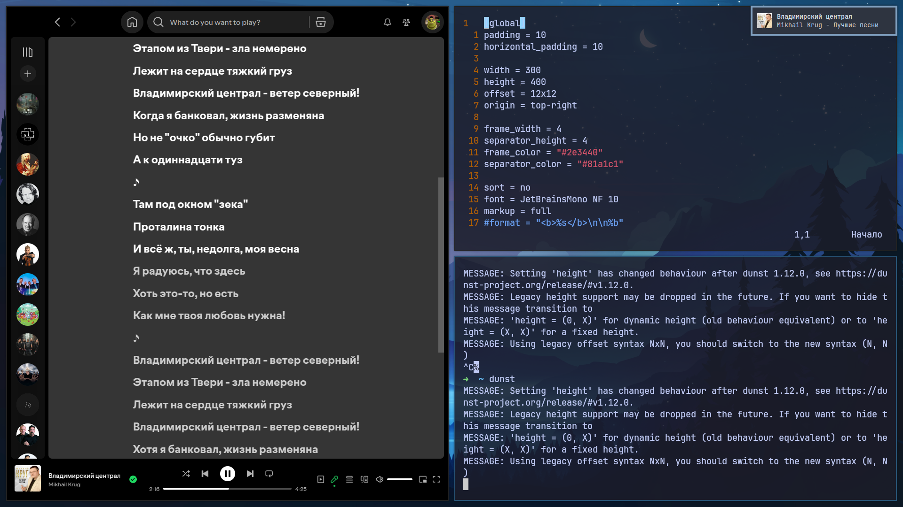

<h1 align="center">Spotifyctl</h1>

<!-- BADGES -->
</br>

<p align="center">
  
  
  </br>
</p>

<!-- ABOUT -->
<h2 align="left"> :blue_book: About</h2> 

__I borrowed the script itself (spotifyctl.sh)__ from [Wandernauta](https://gist.github.com/wandernauta/6800547), but **I wrote the output of the track information via a notification (dunst)**.

<!-- FEATURES -->
## 🚀 Features
* ***Play/pause*** music
* ***Next/prev*** music
* ***Show art/song name/artist*** in a dunst-notify
* ...

<!-- PREVIEW -->
## 🖼️ Preview (Show notify)


**Not customizised dunst**


<!-- HOW DOES IT WORK -->
## 💻 How does it work 
To *send a notification*, you need to **execute the notify-spotify-music.sh**.
It will execute the helper scripts in the following order:

- **download-track-logo** - Downloads the art from its URL in /tmp/spotify-logos (if it has already been downloaded, it will not be downloaded again)
- **to-svg.sh** - Converts the resulting logo to SVG *(because Dunst only accepts images in a .svg format)*

<!-- DEPENDENCIES -->
## 🗿 Dependencies

- [Inkscape](https://inkscape.org/) - It is used to convert to SVG

<!-- INSTALLITION -->
## 📘 Installition

1. **Installing Inkscape** (for convert)
```bash
pacman -S inkscape 
```
2. **Coping a repo**
```bash
git clone https://github.com/MaxProger338/spotifyctl
cd spotifyctl
```
3. **Coping all scripts to a dir** (recomend `~/.local/bin/`)
```bash
cp src/spotifyctl.sh ~/.local/bin
cp src/notify/* ~/.local/bin
```
4. **OPTIONAL: binding them to the keyboard** 

> [!TIP]
> I use i3 under Xorg, so I should bind them in `~/.config/i3/config`.

```bash
#--- SPOTIFY ------------------------------------
bindsym F9 exec ~/.local/bin/spotifyctl.sh next
bindsym F8 exec "~/.local/bin/spotifyctl.sh next && \
                 ~/.local/bin/spotifyctl.sh pause"
bindsym F7 exec ~/.local/bin/spotifyctl.sh prev
bindsym F6 exec ~/.local/bin/spotifyctl.sh play
bindsym F5 exec ~/.local/bin/notify-spotify-music.sh
```