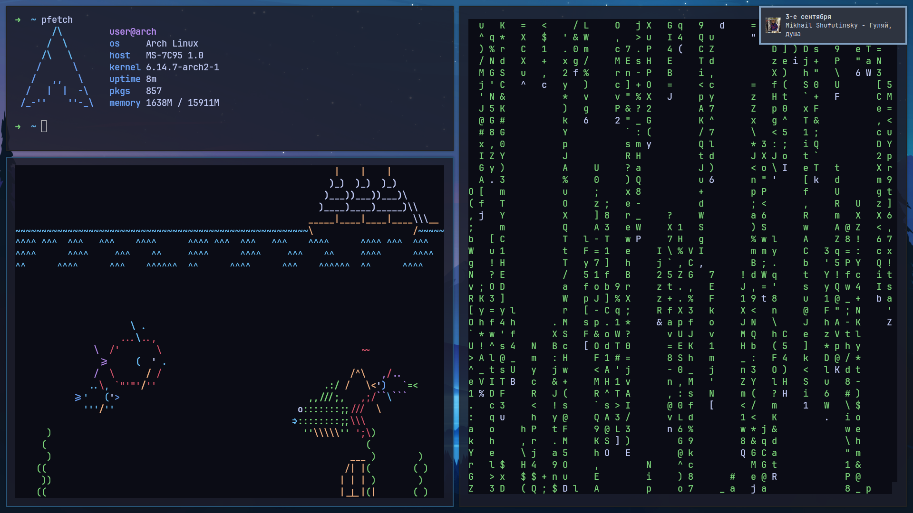

<h1 align="center">Spotifyctl</h1>

<!-- BADGES -->
</br>
<p align="center">
  
  
</p>
<p align="center">
  
</p>

<!-- ABOUT -->
<h2 align="left"> :blue_book: About</h2>

### **English** | [Русский](docs/README_RU.md)

__Stoled it as is__ (from [Wandernauta](https://gist.github.com/wandernauta/6800547)), __screwed dunst__ to output the current track. It works – *and that's fine*.

<!-- FEATURES -->
## 🚀 Features
* ***Play/pause*** music
* ***Next/prev*** music
* ***Show art/song name/artist*** in a dunst-notify
* ...

<!-- PREVIEW -->
## 🖼️ Preview (Show notify)


**Not customizised dunst**


<!-- USAGE -->
## Usage

**Just run the script** with the appropriate parameters ***(spotifyctl.sh)***:

- **next** - play next track
- **prev** - play prev track
- **pause** - only pause the track
- **play** - play/pause the track
- **next-pause** - next and pause
- **notify** - notify

Use `--open` to open Spotify if it doesn't open.

<!-- DEPENDENCIES -->
## 🗿 Dependencies

- [Inkscape](https://inkscape.org/) - It is used to convert to SVG

<!-- INSTALLITION -->
## Autoinstall

**To simply install him, copy and paste it to your terminal:**
```bash
sh -c "$(wget https://raw.githubusercontent.com/MaxProger338/spotifyctl/refs/heads/main/scripts/install.sh -O -)"
```

**To bind him to i3:**
```bash
sh -c "$(wget https://raw.githubusercontent.com/MaxProger338/spotifyctl/refs/heads/main/scripts/bind_i3.sh -O -)"
```

## 📘 Manual Installition

> [!WARNING]
> These scripts works only with POSIX-shells (with [fish](https://github.com/fish-shell/fish-shell) doesn't work)

1. **Installing Inkscape** (for convert)
```bash
pacman -S inkscape 
```
2. **Coping a repo**
```bash
git clone https://github.com/MaxProger338/spotifyctl
cd spotifyctl
```
3. **Coping all scripts to a dir** (recomend `~/.local/bin/spotifyctl`)
```bash
mkdir -p ~/.local/bin/spotifyctl
cp -r src/* ~/.local/bin/spotifyctl
```

4. **Creating symbolic link** to *spotifyctl/spotifyctl.sh*
```bash
ln -s ~/.local/bin/spotifyctl/spotifyctl.sh ~/.local/bin/spotifyctl.sh
```

5. **OPTIONAL: binding them to the keyboard** 

> [!TIP]
> I use i3 under Xorg, so I should bind them in `~/.config/i3/config`.

```bash
#--- SPOTIFY ------------------------------------
# play next
bindsym F9 exec spotifyctl.sh next
# next and pause
bindsym F8 exec spotifyctl.sh next-pause
# play prev
bindsym F7 exec spotifyctl.sh prev
# play/pause
bindsym F6 exec spotifyctl.sh play --open
# show art/name/artist in notify
bindsym F5 exec spotifyctl.sh notify
```

> [!IMPORTANT]
> For this to work, you need to have `~/.loca/bin` added to the **$PATH**.
> ```
> export PATH="$PATH:~/.local/bin"
> ```

<!-- HOW DOES IT WORK -->
## 💻 How does it work 
To *send a notification*, you need to **execute spotifyctl.sh notify**.
It will execute the helper scripts in the following order:

- **download-logo.sh** - Downloads the art from its URL in ~/.tmp/spotify-music-logos (if it has already been downloaded, it will not be downloaded again)
- **convert.sh** - Converts the resulting logo to SVG *(because Dunst only accepts images in a .svg format)*; (if it has already been converted, it will not be converted again)