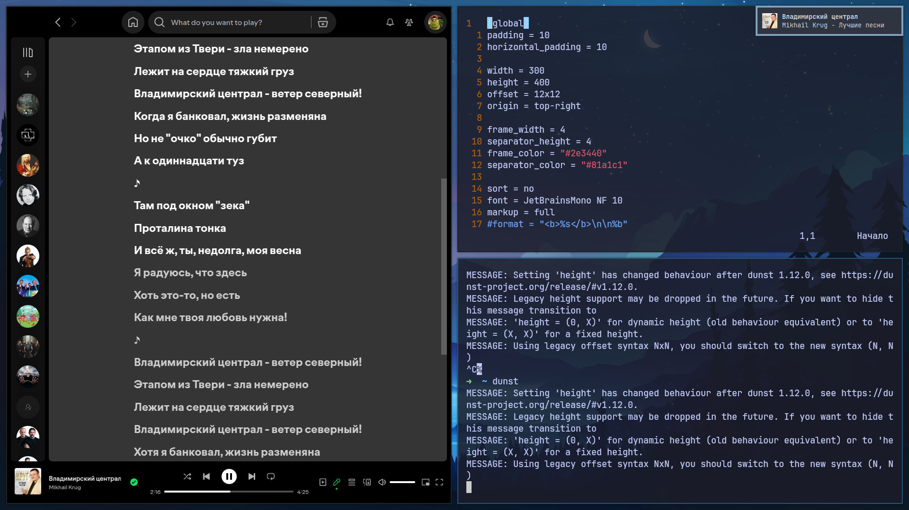
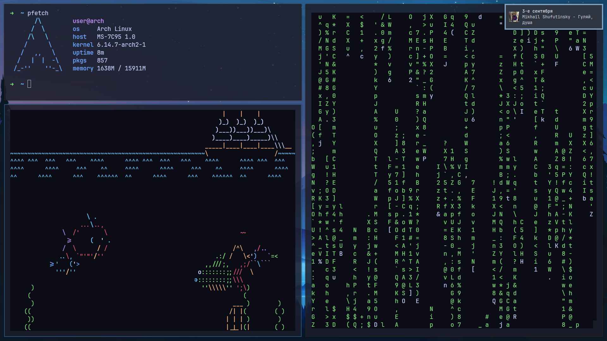
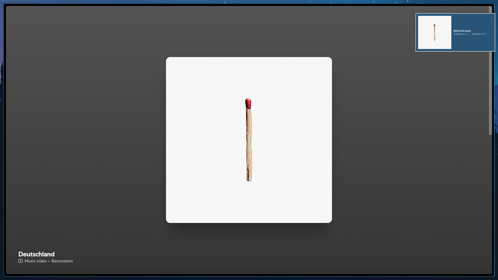

<h1 align="center">Spotifyctl</h1>

<!-- BADGES -->
</br>
<p align="center">
  
  
</p>
<p align="center">
  
</p>

<!-- ABOUT -->
<h2 align="left"> :blue_book: Информация</h2>

### [English](../README.md) | **Русский**

__Украл как есть__ (у [Wandernauta](https://gist.github.com/wandernauta/6800547)), **прикрутил dunst** для вывода текущего трека. Работает — *и ладно*.

<!-- FEATURES -->
## 🚀 Возможности
* ***Воспроизведение/пауза*** музыкы
* ***След/пред*** музыка
* ***Показать арт/название песни/исполнителя*** в dunst-уведомлении
* ...

<!-- PREVIEW -->
## 🖼️ Картинки (Уведомления)


**Некастомизированный dunst**


<!-- USAGE -->
## Использование

**Просто запустите скрипт** с соответствующими параметрами ***(spotifyctl.sh)***:

- **next** - Воспроизвести следующий трек
- **prev** - Воспроизвести предыдущий трек
- **pause** - Только пауза трека
- **play** - Воспроизведение/пауза трека
- **next-pause** - Переключиться на следующий и поставить на пауза
- **notify** - Вывод через *dunst*

Используйте `--open` чтобы открыть Spotify если он не открыт.

<!-- DEPENDENCIES -->
## 🗿 Зависимости

- [Inkscape](https://inkscape.org/) - Он используется для конвертации в SVG

<!-- INSTALLITION -->
## Автоустановка

> [!WARNING]
> Эти скрипты работают только с POSIX-шеллами (с [fish](https://github.com/fish-shell/fish-shell) не работает)

**Чтобы просто установить его, скопируйте и вставьте это в свой терминал:**
```bash
sh -c "$(wget https://raw.githubusercontent.com/MaxProger338/spotifyctl/refs/heads/main/scripts/install.sh -O -)"
```

**Чтобы забиндить его к i3:**
```bash
sh -c "$(wget https://raw.githubusercontent.com/MaxProger338/spotifyctl/refs/heads/main/scripts/bind_i3.sh -O -)"
```

## 📘 Ручная установка

1. **Установка Inkscape** (Для конвертации)
```bash
pacman -S inkscape 
```
2. **Клонируем репо**
```bash
git clone https://github.com/MaxProger338/spotifyctl
cd spotifyctl
```
3. **Копирование всех скриптов в каталог** (рекомендуется `~/.local/bin/spotifyctl`)
```bash
mkdir -p ~/.local/bin/spotifyctl
cp -r src/* ~/.local/bin/spotifyctl
```

4. **Создаём симлинк** на *spotifyctl/spotifyctl.sh*
```bash
ln -s ~/.local/bin/spotifyctl/spotifyctl.sh ~/.local/bin/spotifyctl.sh
```

5. **ОПЦИОНАЛЬНО: привязка их к клавиатуре** 

> [!TIP]
> Я использую i3 под Xorg, поэтому мне следует привязывать их в `~/.config/i3/config`.

```bash
#--- SPOTIFY ------------------------------------
# play next
bindsym F9 exec spotifyctl.sh next
# next and pause
bindsym F8 exec spotifyctl.sh next-pause
# play prev
bindsym F7 exec spotifyctl.sh prev
# play/pause
bindsym F6 exec spotifyctl.sh play --open
# show art/name/artist in notify
bindsym F5 exec spotifyctl.sh notify
```

> [!IMPORTANT]
> Чтобы это работало, вам нужно добавить '~/.loca/bin' в $PATH.
> ```
> export PATH="$PATH:~/.local/bin"
> ```

<!-- HOW DOES IT WORK -->
## 💻 Как это работает
Чтобы *отправить уведомление*, вам необходимо **выполнить spotifyctl.sh notify**. Он будет выполнять вспомогательные скрипты в следующем порядке: 
- **download-logo.sh** - Скачивает арт по его URL в ~/.tmp/spotify-logos (если он уже был скачен, он не будет скачиваться снова)
- **convert.sh** - Конвертирует полученный логотип в SVG *(т.к. Dunst принимает изображения только в .svg формате)*; (если он уже был конвертирован, он не будет конвертироваться снова)